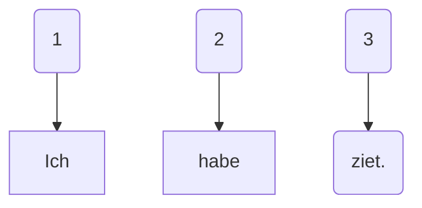
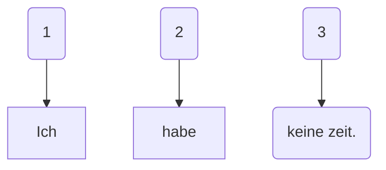
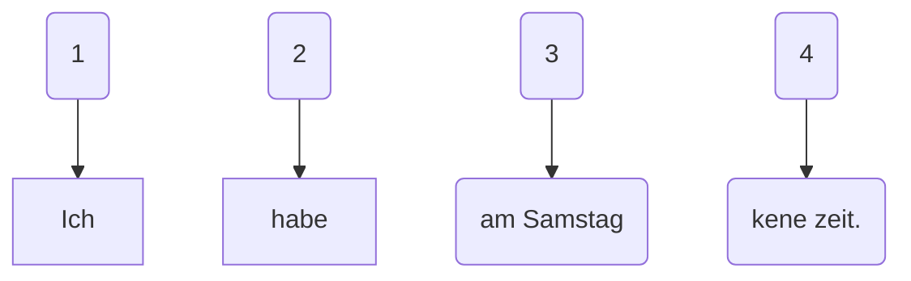
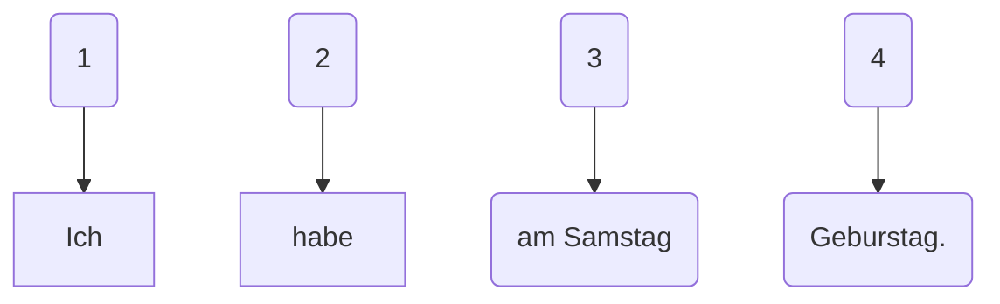

### 
zeit haen

---

- Geburstag haben - me pasë ditëlindjen.

- Ich habe Geburstag.

- Party machen - me bo parti (aheng)

- Ich mache eine Party.

---

- am Morgen - në mengjes

- am Vormittag - paradite

- am Nachmittag - pasëdite

- am Abend - në mbrëmje

- in der Nacht - Natën

- Pizza essen - me ngrënë pica.

- Ich esse gern Pizza.

- ins Kino gehen - me shku në kinema.

- Ich gehe am Wochenede ins Kino.

- Musik hören - me dëgju muzikë.

- Ich höre am Abend Musik.

- spazieren gehen - me dal me shetitë.

- Ich gehe heute spazieren.

---

Credits: Arianit KUKAJ
