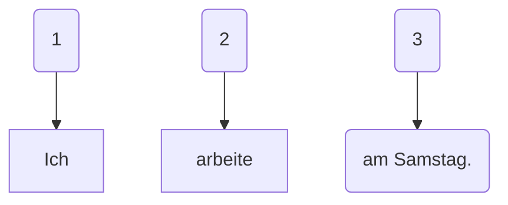
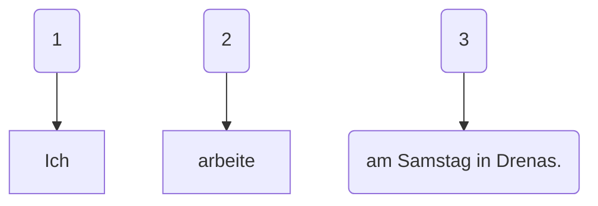
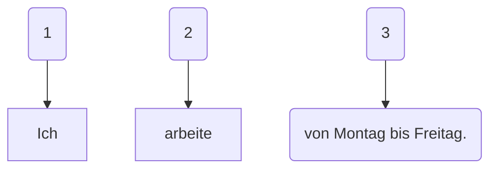
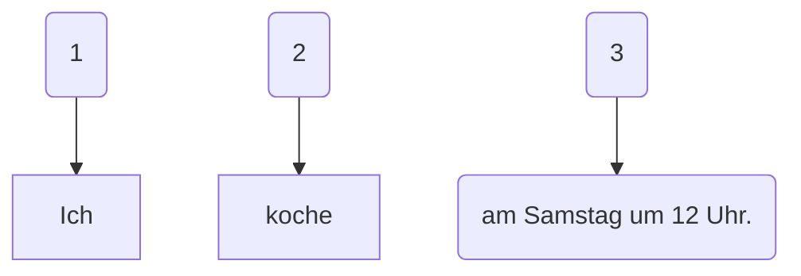
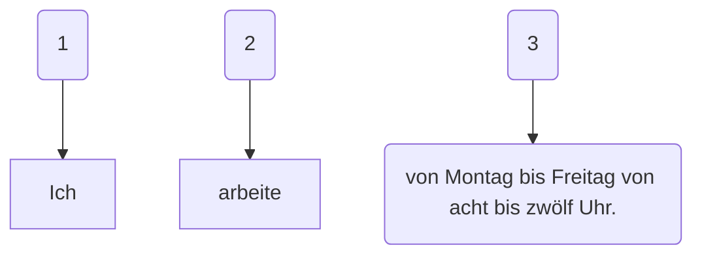

### 
machen - bëj

- Ich <u>mache</u> sport. - Unë bëjë sport.

- Ich <u>mache</u> Hausaufgaben. - Unë bëjë detyrat e shtepisë.

- arbeiten - punojë

- Ich arbeite nicht. Unë nuk punojë.

- Kochen - gatuaj

- Ich <u>koche</u>. - Unë gatuaj.

- Ich <u>koche</u> heute. - Unë gatuaj sot.

---

- Montag - E henë

- Dienstag - E martë

- Mitwoche - E merkurë

- Donnerstag -  E enjtë

- Freistag - E premtë

- Samstag -  E shtunë

- Sonnstag - E diel

---

- Samstag - E shtunë

- Ich arbete.

- Ich arbete am Samstag.

- Ich arbeite am Samstag in Drenas.

- von ... bis ... nga ... deri

- Ich arebite von Montag bis Freitag.

- 12 Uhr. - në orën 12.

- am 12 Uhr - në orën 12.

- Ich koche.

- Ich koche am Samstag um 12 Uhr.

- Ich arbeite von Montag bis Freitag von acht bis zwölf Uhr.

- Das Wochenende - fundjava

- am Wochenede - në fundjavë

---

Credits: Arianit KUKAJ
